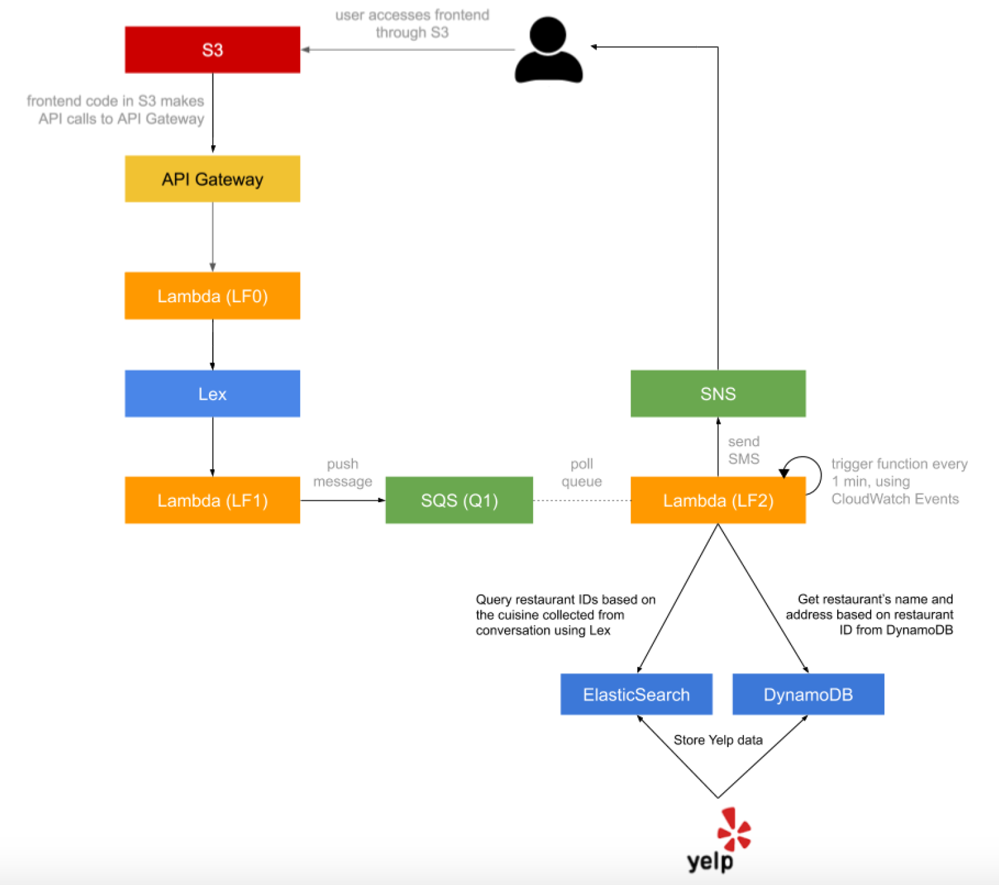

# Dining Concierge Chatbot

Nitisha Shetty (ns6108@nyu.edu), Sakshi Goenka (sg8156@nyu.edu)

Welcome to the Dining Concierge Chatbot project! This serverless, microservice-driven web application helps users find restaurant suggestions based on their preferences through a conversational interface.

## Project Overview

The Dining Concierge Chatbot uses various AWS services to create a seamless experience for users seeking restaurant recommendations. Here's a brief overview of the main components:

1. Frontend: Hosted on AWS S3, providing a user-friendly interface for interacting with the chatbot.
2. API Gateway: Manages the API for communication between the frontend and backend services.
3. Lambda Functions: Handle various aspects of the application logic.
4. Amazon Lex: Powers the natural language processing capabilities of the chatbot.
5. DynamoDB: Stores detailed restaurant information.
6. Amazon OpenSearch Service (ElasticSearch): Enables efficient querying of restaurant data.
7. SQS: Manages the queue for processing user requests.
8. SES: Sends email notifications with restaurant suggestions.

## Lambda Functions

### LF0: Chat Operation
- We have two different versions of LF0, LF0_v1 containing of the simple boilerplate and LF0_v2 which contains the fully functioning operation
- Receives messages from the frontend via API Gateway
- Forwards user input to Lex and returns Lex responses

### LF1: Lex Code Hook
- Handles Lex intents (GreetingIntent, ThankYouIntent, DiningSuggestionsIntent, FallbackIntent)
- Collects and validates user preferences
- Pushes collected information to SQS for processing

### LF2: Restaurant Suggestion Worker
- Pulls messages from SQS
- Queries ElasticSearch for restaurant recommendations based on user preferences
- Retrieves detailed restaurant information from DynamoDB
- Formats and sends suggestions (5 in count) via email using SES

## Application Flow

1. User interacts with the frontend, sending messages through the chat interface.
2. API Gateway receives the request and triggers LF0.
3. LF0 forwards the user's message to Lex.
4. Lex processes the message, invoking LF1 as needed to handle intents and collect information.
5. For dining suggestions, LF1 pushes the collected preferences to SQS.
6. LF2, triggered by CloudWatch events, processes the SQS message.
7. LF2 queries ElasticSearch and DynamoDB for restaurant recommendations.
8. LF2 sends an email with suggestions to the user via SES.

## Key Features

- Natural language conversation for collecting user preferences
- Integration with Yelp API for restaurant data
- Efficient querying using ElasticSearch
- Detailed restaurant information stored in DynamoDB
- Automated suggestion processing and email notifications

This project demonstrates the power of serverless architecture and microservices in creating a responsive, scalable application for enhancing customer service in the dining industry.

## ARCHITECHTURE

